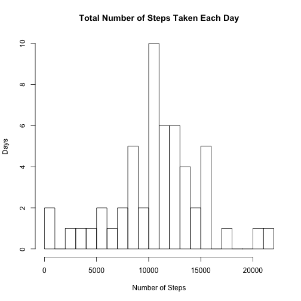

## Loading and preprocessing the data
Here we load the data from disk.   We also set some basic options to control how numbers are printed.


```r
# Set options to NOT print numbers as scientific notation and use only 3 decimal points
options("scipen" = 1)
options("digits" = 3)

# Read the data from disk into a Data Frame
stepdata <- read.csv("activity.csv")
```

## What is mean total number of steps taken per day?

Here we compute the mean total number of steps taken per day and present the results in a histogram.  We also compute the overall mean and median number of steps taken.


```r
##
##   Part 1 - Histogram of Total Number of Steps Taken Each Day + Mean and Median
##

# Split the data by date to make it easier to work with
daydata <- split(stepdata, stepdata$date)

# Initialize some vectors
sum_step_vector <- as.vector(NULL)
mean_step_vector <- as.vector(NULL)

# Iterate across all of the dates, computing the sum and a mean values for
#  the number of steps taken on each day.   Discard missing values.
for (day in levels(stepdata$date)) {
  steps_data_frame <- as.data.frame(daydata[day])
  steps_for_day <- steps_data_frame[,1]
  total_steps_for_day <- sum(steps_for_day, rm.na=TRUE)
  
  # accumulate total and mean vectors that can be used for plotting and subsequent computation
  sum_step_vector  <- c(sum_step_vector, total_steps_for_day)
  mean_step_vector <- c(mean_step_vector, mean(steps_for_day, rm.na=TRUE))
}

# plot the histogram showing the total number of steps taken on each day
hist(sum_step_vector, breaks=30, xlab="Number of Steps", ylab="Days", main="Total Number of Steps Taken Each Day")
```

 

The **mean** number of steps taken per day is computed as: 


```r
mean_steps <- mean(sum_step_vector, na.rm=TRUE)
message(mean_steps)
```

```
## 10767.1886792453
```

The **median** number of steps taken per day is computed as:

```r
median_steps <- median(sum_step_vector, na.rm=TRUE)
message(median_steps)
```

```
## 10766
```

  
  
  

## What is the average daily activity pattern?

Here we analyze the daily activity pattern by summarizing the number of steps taken in each 5-minute interval across all days in our data.   We construct a time series plot of the average number of steps taken in each of the 5-minute intervals across all days.


```r
######
######   Part 2 - Average Daily Activity Patterns
######

# Initialize some vectors
sum_interval_vector <- as.vector(NULL)
average_steps_per_interval <- as.vector(NULL)

# This time, we split the data by Interval (instead of date)
intervaldata <- split(stepdata, as.factor(stepdata$interval))

# Initialize some variables before entering the loop
max_interval_val = as.numeric(0)
max_interval_index = NA

# iterate across all interval levels to compute the mean activity level per 
#   interval across all days
for (interval in levels(as.factor(stepdata$interval))) {
    steps_data_frame <- as.data.frame(intervaldata[interval])
    steps_for_interval <- steps_data_frame[,1]
    
    # compute the mean value for all steps in this interval and discaring missing values
    #  Also track the interval averages across all days that contains the maximum number steps
    val = mean(steps_for_interval,na.rm=TRUE)
    if(val > max_interval_val) {
      max_interval_val = val
      max_interval_index = interval
    }
    
    # accumulate a vector of all step averages per interval for later plotting
    average_steps_per_interval <- c(average_steps_per_interval, val)
    
}

# compute the overal average number of steps across all intervals
overall_average_interval <- mean(average_steps_per_interval, na.rm=TRUE)

# Create a time series plot showing the average steps per interval as averaged across all days
plot(levels(as.factor(stepdata$interval)), average_steps_per_interval, type="l", xlab="5-Minute Interval", ylab="Average # Steps per 5-Minute Interval", main="Average Daily Activity")
```

 

The 5-minute interval, averaged across all days in the dataset, that contains the maximum number of steps is 835.   The maximum number of steps, averaged across all days, in this interval is 206.17. 

## Imputing missing values

Here, we count the number of missing values in the original dataset and replace those missing values with an imputed value.   We use the overall mean number of steps per day that was computed using the original dataset to fill in for any missing value.


```r
##
## Part 3 - Imputing Missing Values
##

# Copy our dataset to a new data frame, since we will be modifying it
#  my imputing and filling in missing data
imputed_data <- stepdata

#
# Simplistically impute missing values by replacing missing values with the 
#  overall average number of steps per interval (as computed previously)
#  and rounded to the nearest whole step
#
missing_value_count <- as.integer(0)
for(i in 1:nrow(imputed_data)) { 
  if(is.na(imputed_data[i,"steps"])) {
    missing_value_count <- missing_value_count + 1
    day = imputed_data[i,"date"]
    imputed_data[i,"steps"] <- round(overall_average_interval)
  }
}

# Once the missing values are imputed and filled, lets split the
#   data by day in order to compute the total, mean, and median number 
#   of steps taken per day
daydata <- split(imputed_data, imputed_data$date)
sum_step_vector <- as.vector(NULL)
mean_step_vector <- as.vector(NULL)

# iterate over all days in the modified dataset
for (day in levels(imputed_data$date)) {
  steps_data_frame <- as.data.frame(daydata[day])
  steps_for_day <- steps_data_frame[,1]
  total_steps_for_day <- sum(steps_for_day)
  
  sum_step_vector  <- c(sum_step_vector, total_steps_for_day)
  mean_step_vector <- c(mean_step_vector, mean(steps_for_day))
}

# Plot the histogram of the total number of steps taken each day, based on the imputed/filled data
hist(sum_step_vector, breaks=30, xlab="Number of Steps", ylab="Days", main="Total Number of Steps Taken Each Day", sub="(For Dataset with Imputed Missing Values)")
```

 

```r
# Calculate the overall mean and median number of steps taken per day based on the new dataset
mean_steps_imputed <- mean(sum_step_vector)
median_steps_imputed <- median(sum_step_vector)
```
  
We counted 2304 total missing values in the original dataset.  

Using the dataset with imputed missing values, the overall mean number of steps per day is: 10751.738 while the median number of steps is 10656.   Interestingly, the difference between the mean of the **original** dataset with missing values (10767.189) and the mean of the **new** dataset with imputed missing values (10751.738) is negligible.   This is a side effect with to the way in which the imputed missing values were filled with the overall daily mean computed from the dataset with missing values, thereby keeping nearly the same means.   The median value differs more substantially between the **original** dataset (10766) and the **new** dataset with imputed missing values (10656) and is mainly due to accumulated rounding error.  


## Are there differences in activity patterns between weekdays and weekends?

Here we examine differences in activity levels between weekends and weekdays.  We create a panel plot which highlights the differences in average activity throughout the day between weekdays and weekends.


```r
##
## Part 4 - Differences in activity patterns between weekdays and weekends
##
daytype_vector <- as.vector(NULL)


# Iterate cross the original dataset to categorize each day as a weekday or a 
#   weekend and construct a "daytype" vector that we then add as a column to the
#   original data frame.   We will then subsequently use that new categorization column
#   when comparing activity levels on weekends vs. weekdays
for (i in 1:nrow(stepdata)) {
  if(weekdays(as.Date(stepdata[i,"date"])) == "Saturday" ||
     weekdays(as.Date(stepdata[i,"date"])) == "Sunday") {
      daytype_vector <- c(daytype_vector, "weekend")
  } else {
      daytype_vector <- c(daytype_vector, "weekday")
  }
}

stepdata$daytype <- as.factor(daytype_vector)

# initiaize some vector variables prior to entering the loop
weekend_interval_means <- as.vector(NULL)
weekday_interval_means <- as.vector(NULL)

# iterate across all interval levels in the dataset to compute the 
#   weekend interval meand and the weekday interval means
for(interval in levels(as.factor(stepdata$interval))) {
  x<-stepdata[((stepdata$interval==interval) & (stepdata$daytype=="weekend")),]
  m<-mean(x$steps,na.rm=TRUE)
  weekend_interval_means <- c(weekend_interval_means, m)
  
  x<-stepdata[((stepdata$interval==interval) & (stepdata$daytype=="weekday")),]
  m<-mean(x$steps,na.rm=TRUE)
  weekday_interval_means <- c(weekday_interval_means, m)
}

# setup and construct a panel plot of two time series plots across all time intervals
#   that depict the weekend vs. weekday activity patterns
old_par <- par(mfrow=c(2,1), mar=c(4,4,3,1))
plot(levels(as.factor(stepdata$interval)), weekend_interval_means, xlab="", ylab="Weekend", type="l", main="Weekend and Weekday Activity Patterns")
plot(levels(as.factor(stepdata$interval)), weekday_interval_means, xlab="Interval", ylab="Weekday", type="l")
```

 

```r
par(old_par)
```

